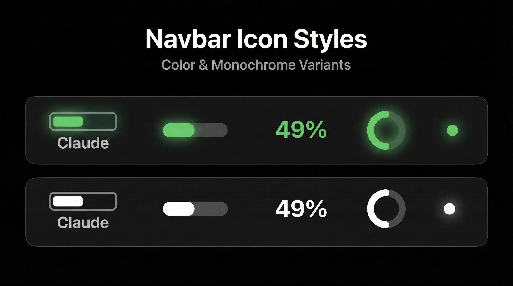
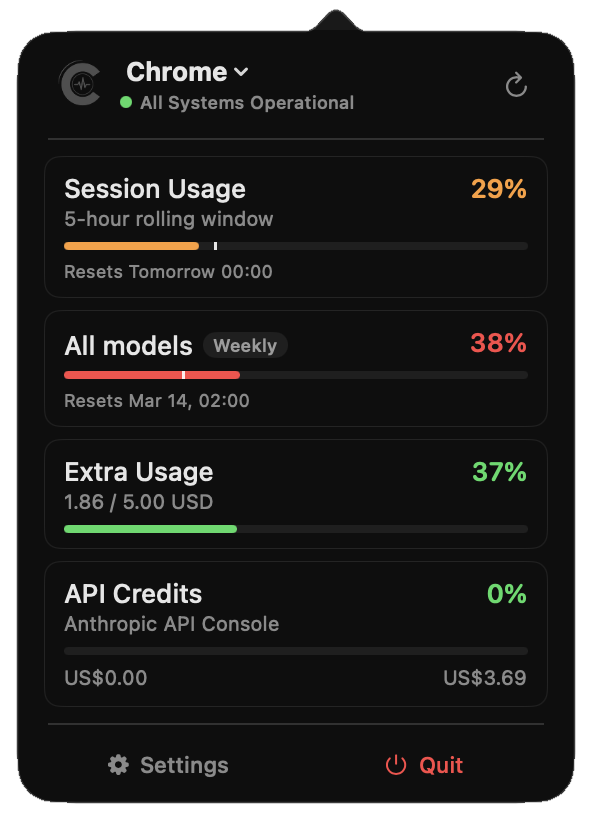
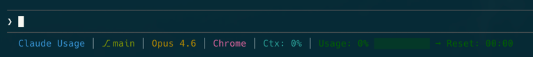

# Claude Tracker

<div align="center">
  

  **Actively maintained fork of [Claude-Usage-Tracker](https://github.com/hamed-elfayome/Claude-Usage-Tracker) with 12+ bug fixes and new features.**

  
  
  
  
  
  

  ### [Download Latest Release (v2.4.0)](https://github.com/novastate/Claude-Tracker/releases/tag/v2.4.0)

  <sub>macOS 14.0+ (Sonoma) | ~6 MB | Native Swift/SwiftUI</sub>
</div>

---

## Why this fork?

The [original repo](https://github.com/hamed-elfayome/Claude-Usage-Tracker) has 30+ open issues and 13 unmerged PRs with no maintainer activity. This fork fixes the most critical bugs and adds features requested by the community.

### Bug fixes

| Issue | Problem | Status |
|-------|---------|--------|
| [#145](https://github.com/hamed-elfayome/Claude-Usage-Tracker/issues/145) | CLI tokens not detected (Claude Code v2.1.52+ changed keychain name) | Fixed |
| [#149](https://github.com/hamed-elfayome/Claude-Usage-Tracker/issues/149) / [#129](https://github.com/hamed-elfayome/Claude-Usage-Tracker/issues/129) | Credentials corrupted due to truncated keychain JSON (~2KB limit) | Fixed |
| [#139](https://github.com/hamed-elfayome/Claude-Usage-Tracker/issues/139) | Usage stuck on yesterday (ms/s token expiry bug) | Fixed |
| [#150](https://github.com/hamed-elfayome/Claude-Usage-Tracker/issues/150) | Repeated "session reset" notifications across profiles | Fixed |
| [#114](https://github.com/hamed-elfayome/Claude-Usage-Tracker/issues/114) | CLI connected but usage shows 0% | Fixed |
| [#112](https://github.com/hamed-elfayome/Claude-Usage-Tracker/issues/112) | Auto-start session reports success but fails to initialize | Fixed |
| [#136](https://github.com/hamed-elfayome/Claude-Usage-Tracker/issues/136) | Empty chat created every 5 minutes by auto-start | Fixed |
| [#105](https://github.com/hamed-elfayome/Claude-Usage-Tracker/issues/105) | Refresh fails silently after system sleep/wake | Fixed |
| [#97](https://github.com/hamed-elfayome/Claude-Usage-Tracker/issues/97) | Status bar icon disappears on re-enable | Fixed |
| [#147](https://github.com/hamed-elfayome/Claude-Usage-Tracker/issues/147) | Wrong profile name in multi-profile popover | Fixed |
| [#146](https://github.com/hamed-elfayome/Claude-Usage-Tracker/issues/146) | Statusline not showing active profile | Fixed |

### New in this fork

- **Stale data warning** — "Updated Xm ago" timestamp + orange "Credentials expired" banner when auth fails
- **Keychain service name discovery** — auto-detects hashed keychain names from Claude Code v2.1.52+
- **JSON truncation fallback** — validates keychain JSON, falls back to `~/.claude/.credentials.json`
- **Per-profile notification tracking** — no more cross-profile notification spam
- **Sleep/wake recovery** — timers survive system sleep, refresh triggers on wake

---

## Install

### Download (recommended)

1. Download [Claude-Usage-v2.4.0.zip](https://github.com/novastate/Claude-Tracker/releases/tag/v2.4.0)
2. Unzip and drag `Claude Usage.app` to `/Applications/`
3. Launch

### Build from source

```bash
git clone https://github.com/novastate/Claude-Tracker.git
cd Claude-Tracker
open "Claude Usage.xcodeproj"
# Build and run (Cmd+R)
```

---

## Quick start

**With Claude Code (easiest):** Just launch the app. It auto-detects your CLI credentials.

**Manual setup:**
1. Go to [claude.ai](https://claude.ai) > DevTools > Application > Cookies > `sessionKey`
2. Copy the value (starts with `sk-ant-sid01-...`)
3. Open the app > Settings > Claude.AI > paste and follow the 3-step wizard

---

## Features

<div align="center">
  
  
</div>

- **Real-time monitoring** — session (5h), weekly, and Opus usage in the menu bar
- **5 icon styles** — battery, progress bar, percentage, icon+bar, compact
- **Multi-profile** — unlimited accounts with isolated credentials, simultaneous menu bar display
- **Claude Code CLI integration** — one-click credential sync, auto-switch on profile change
- **API console tracking** — monitor API billing alongside subscription usage
- **Terminal statusline** — usage, git branch, and directory in Claude Code's statusline
- **Auto-start sessions** — automatically initializes sessions when usage resets to 0%
- **Threshold notifications** — alerts at 75%, 90%, 95% usage per profile
- **Detachable popover** — drag the popover to keep it as a floating window
- **8 languages** — English, Spanish, French, German, Italian, Portuguese, Japanese, Korean
- **Privacy-first** — local storage only, no telemetry, no cloud sync

<div align="center">
  
  <br>
  <sub>Terminal statusline: directory, branch, color-coded usage, progress bar, reset time</sub>
</div>

---

## Credits

Originally created by [hamed-elfayome](https://github.com/hamed-elfayome/Claude-Usage-Tracker). Actively maintained by [novastate](https://github.com/novastate).

## License

MIT License — see [LICENSE](LICENSE) for details.

## Disclaimer

Not affiliated with, endorsed by, or sponsored by Anthropic PBC. Claude is a trademark of Anthropic PBC.
